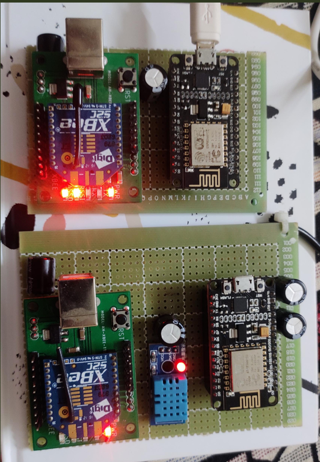
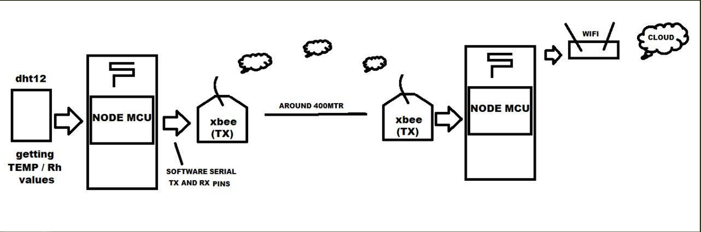
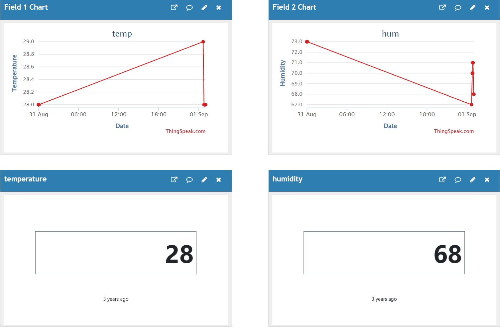

## IoT Based Smart Agriculture--2022

(> Note: This project was developed in 2022 as part of my undergraduate coursework. The API key and Wi-Fi credentials shown in the code are outdated and were used only for academic demonstration.
)

## Hardware Overview:
- XBEE(2)
- NODEMCU(2)
- DHT11 sensor
- Capacitors

## Hardware setup & BlockDiagram:
-->Each XBee module is interfaced with a NodeMCU board, along with capacitors for stability. The transmitter side is connected to a DHT11 sensor.

## Technologies Used:
- Arduino IDE
- C/C++ (embedded)
- RF Transceivers
- ESP8266 (NodeMCU)
- ThingSpeak IoT Cloud
- Sensors: DHT11 (Temp/Humidity)

## Code Files Explained:

| File Name              | Purpose |
|------------------------|---------|
| `tx_code.ino`          | RF transmitter logic |
| `getSensors_data.ino`  | Collects sensor data |
| `NODEMCU_TEMP_HUM.ino` | Uploads data to ThingSpeak |
| `stationDefines.h`     | Configuration (WiFi, API key, pins) |
| 'Images'                 | List of Images  |

## RESULTS:

## Author Details:

SRI VAISHNAVI KIRAN NUKALA
PHONE NO: +1 (518)-847-6845
EMAIL: vaishnavinukala03@gmail.com

